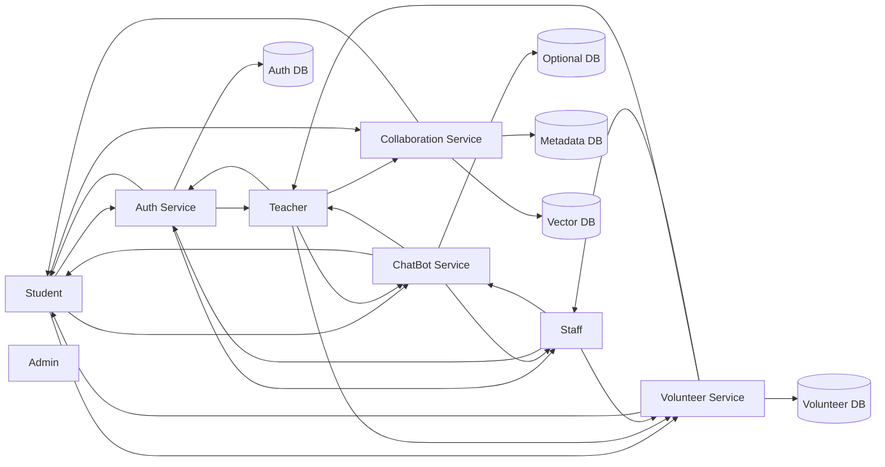
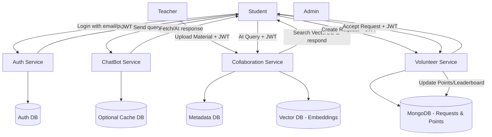

# 🏫 CampusMate.ai Microservices Architecture

## 🚀 Vision

CampusMate.ai is an **AI-powered digital campus assistant** designed to improve communication, collaboration, and emergency support within the university.
It combines three main modules:

1. 🤖 **Smart ChatBot** – fetch real-time university updates.
2. 📚 **Teacher–Student Collaboration Hub** – AI-enhanced learning and material management.
3. ❤️ **Emergency Volunteering Platform** – request and provide help within the campus community.

All users (students, teachers, staff) must be **verified by the admin** to access features.

---

## 📌 Microservices Overview

| Service                   | Tech Stack                              | Responsibilities                                                                        | Database                    |
| ------------------------- | --------------------------------------- | --------------------------------------------------------------------------------------- | --------------------------- |
| **Auth Service**          | FastAPI + PostgreSQL                    | Centralized user authentication, role management, JWT token issuance                    | Auth DB                     |
| **ChatBot Service**       | FastAPI                                 | Fetch notices, bus schedules, emergency contacts, holidays; AI Q/A                      | Optional ChatBot DB         |
| **Collaboration Service** | FastAPI                                 | Upload course materials, exams, assignments; AI-powered learning; vector DB integration | Collaboration DB + VectorDB |
| **Volunteer Service**     | MERN (MongoDB, Express, React, Node.js) | Post/accept help requests; notifications; leaderboard                                   | Volunteer DB                |

---

## 🔹 Authentication Flow

* **Auth Service** is the single source of truth for authentication.
* Users log in → receive a **JWT token** containing user info:

```json
{
  "user_id": "stu123",
  "role": "student",
  "dept": "CSE",
  "session": "2020-21"
}
```

* All other microservices validate the token and **trust the user info**.
* Each microservice uses its own database for its domain, linking users via `user_id`.

---

## 🏗 System Architecture (Overview)



---

## 🔹 End-to-End Workflow



---

## 🔹 Service Workflows

### 1. Auth Service (FastAPI)

* Handles **registration**, **login**, and **role verification**.
* Issues JWT tokens for other microservices.
* **Database**: `AuthDB` (PostgreSQL) – stores `user_id`, `email`, `role`, `session`, `department`, `hashed_password`.

---

### 2. ChatBot Service (FastAPI)

* Fetches real-time notices, bus schedules, emergency contacts, and holidays.
* AI integration for question-answering.
* **Database**: optional cache DB (`ChatDB`).
* Uses **JWT** for user verification.

**Example Request:**

```http
POST /chatbot/query
Headers: Authorization: Bearer <jwt>
Body: {"question": "When is next holiday?"}
```

---

### 3. Collaboration Service (FastAPI)

* Teachers upload course materials → stored in file storage (S3/local).
* Text extracted → embeddings stored in **VectorDB**.
* Students query AI → only materials from their **course + session + semester** are retrieved.
* **Databases**: `CollabDB` (metadata), `VectorDB` (embeddings).

**Example Flow:**

1. Teacher uploads material:

```http
POST /collab/upload
Headers: Authorization: Bearer <jwt>
Body: { "course": "CSE401", "semester": "4-1" }
File: lecture1.pdf
```

2. Student queries:

```http
POST /collab/ask
Headers: Authorization: Bearer <jwt>
Body: {"question": "Explain OS deadlock."}
```

* Response includes AI-generated answer from relevant course materials.

---

### 4. Volunteer Service (MERN)

* Users post emergency help requests.
* Students receive notifications and can accept requests.
* After completion, points awarded → leaderboard updated.
* **Database**: `VolunteerDB` (MongoDB).

**Example Flow:**

1. Post request:

```http
POST /volunteer/request
Headers: Authorization: Bearer <jwt>
Body: {"title": "Need O+ blood", "location": "Mymensingh Medical"}
```

2. Student responds:

```http
POST /volunteer/respond
Headers: Authorization: Bearer <jwt>
Body: {"requestId": "req123"}
```

3. Confirm help:

```http
POST /volunteer/confirm
Headers: Authorization: Bearer <jwt>
Body: {"requestId": "req123", "helperId": "stu789"}
```

---

## 🔹 Database Strategy

| Database                       | Purpose                            | Notes                    |
| ------------------------------ | ---------------------------------- | ------------------------ |
| AuthDB (PostgreSQL)            | User accounts, roles, verification | Centralized auth         |
| ChatDB (PostgreSQL / optional) | Cached notices & schedules         | Only ChatBot service     |
| CollabDB (PostgreSQL)          | Course metadata, uploads           | Linked by `user_id`      |
| VectorDB (Pinecone / FAISS)    | Embeddings for AI queries          | Linked by course/session |
| VolunteerDB (MongoDB)          | Emergency requests & leaderboard   | Flexible schema          |

**Key Concept:**

* All services use **their own DB** for domain-specific data.
* **Authentication always goes through Auth Service**.
* `userId` is the **common link** across services.

---

## 🔹 Advantages of Microservices Design

* Scalable: each module deployable independently.
* Technology flexibility: FastAPI for AI-heavy services, MERN for dynamic volunteer system.
* Security: JWT tokens unify authentication across all services.
* Clear separation of concerns → easier maintenance and updates.

---

## ✅ Summary

* CampusMate.ai consists of **ChatBot, Collaboration, and Volunteer** microservices.
* **Auth Service** centralizes authentication.
* Each microservice has **its own database**.
* JWT tokens allow **secure cross-service access**.
* VectorDB enables **AI-powered personalized learning**.
* Volunteer service includes **real-time notifications and points system**.
